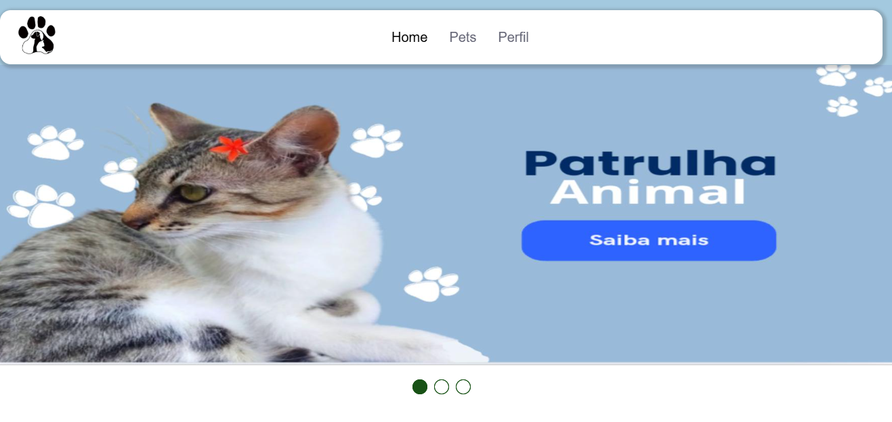

# Patrulha Animal



## Inciando projeto
dê esses comandos no terminal

```shell
npm i
npx prisma migrate dev --name init
npm run dev
```

Após isso, utilizando a extensão live server, inicie o home.html
